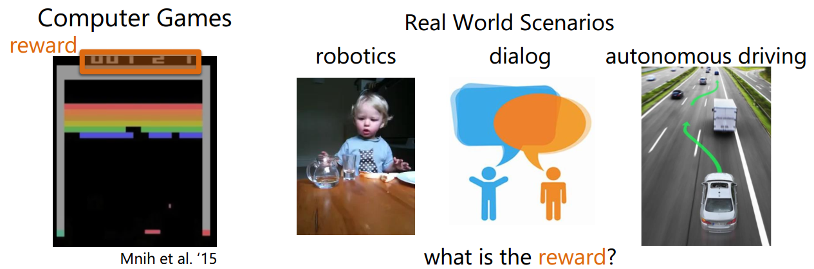
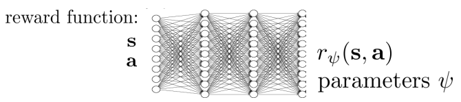

# 10. Model-based RL

上一章说的是Model-based Planning，即结合已知的dynamics，做出更好的value function的估计和更好的决策。本章的Model-based RL 是指，dynamics未知（本文特指状态转移，好像现在对reward function都不会怎么学习？reward都是专业知识？），但是我们要去学习它！学习到之后，我们又可以做planning啦。model-based RL和model-free RL的区别就是前者是去学习dynamics，然后获得value function或者policy，后者是直接去学习value function或者policy，而不依赖dynamics。所以model-based RL可以用下面的图表示，这里的地球是一个卡通图案，表示他是我们通过样本学习到的dynamics，然后整个RL过程就在这样的已知的dynamics中进行。

下面是一个model-based RL的流程图：一开始我们初始化一定的policy，用他和环境交互，获得经验数据；在使用这个经验数据学习出dynamics。当dynamics已知的时候，我们就可以planning出更好的policy。比如使用动态规划planning（policy iteration, value iteration, MC, TD等等），Stochastic optimization，MCTS等model-based planning的方法。但是，这种相互依赖的loop，一好则好，一旦学习有猜错，那就开始累计了。实际效果会限制于所学习的model/dynamics的好坏。因此，如果model学得太烂，完全就可以用model-free等等的方式

## 10.1 Planning with learned dynamics

从上面的示意图，只能看出model-based RL由三个步骤组成：

1. 用当前的policy/value，出招，得到一些反馈数据
2. 根据反馈数据，学习出一个dynamics $f$
3. 根据$f$来planning，优化policy/value

在实际操作中，会有一些其他问题：训练数据是否足够用来学习，是否能学习到一个好的模型？

### 10.1.1 Distribution mismatch

训练数据是源于真实的MDP，但是训练数据是否能很好的反应MDP，这是未知的。比如在自动驾驶问题中，如果车子一直都在左转弯绕圈，那么用这样的数据所学习的planning，不就只能左转弯了么。实际上训练数据（左转绕圈）和真实驾车场景是不一样的。如果我们用于学习dynamics的算法很厉害，拟合能力很强，那么这个问题就会更加突出，因为学到的dynamics overfits，建立在它之上的planning也就不会好。

解决这个问题的一个可行方案就是扩充训练数据集，竟可能的去避免mismatch。如下所示，在第4步增加数据扩充的步骤。

这个策略和模仿学习(imitation learning)中的DAgger算法（Dataset Aggregation）很相似（伪代码如下），对于DAgger算法的dabug就是要人来打标签，选动作。而在强化学习中，则是直接使用当前policy的动作值当label，勉强人工的过程。

但是，这个扩充数据集的方法就不适用于open loop plan了，毕竟没有交互，就没机会得到新数据。

### 10.1.2 Model error

另一个问题就是，真实的dynamics我们是不知道的。通过学习出来的dynamics很有可能是不准确的，甚至是有大bug的。比如在自动驾驶问题中，如果dynamics学得不好，在给定状态下做的planning，也许会给出错误的答案：如果学习到的dynamics告诉你前面是个左转弯（实际上是直路），那么planning会告诉你赶紧左转，但是一旦左转，那就会冲出公路咯。

这种情况下，除了数据扩充的方法外，还可以re-planning。在一段时间之后的新状态下，进行重新planning，一旦re-planing的结果发现不能再左转了（即使学习到的dynamics告诉你应该要左转），这个时候还是有改正的机会。

下面代码的第3就是re-planning（注意，之前的代码是每N次，更新一次dynamics，然后做一次planning，这里是每N次，更新一次dynamics，但是planning是做了N次的）

但是这里re-planning带来的计算量不会太恶心，因为如果每次都在做planning的话，其实不用去plan那些时间片很久以后的事，往往plan一个短期的future就很work了，这时候就可以使用上一章提到的Stochastic optimization方法了。

## 10.2 Learn a model by supervised learning

为了要学习dynamics（这里特指状态转移和reward function），可以求助由于监督学习。给定训练数据$\{s_{t},a_{t},r_{t+1},s_{t+1}\}^n$，我们要求解的是$s_{t+1}=P(S_{t+1}\mid S_{t},A_{t})$和$r_{t+1}=R(R_{t+1}\mid S_{t},A_{t})$。这时候监督学习学习的目标不在是label，而是输入$s_{t},a_{t}$，输出$s_{t+1}$和$r_{t+1}$。回想最开始我们提到的动态系统，就可以用来解他们，而且还是考虑到了数据之间的依赖情况。当然，我们也可以把这种依赖情况忽略，之间采用简单的模型去拟合：

$$
s_1,a_1 \rightarrow r_2,s_2\\
s_2,a_2 \rightarrow r_3,s_3\\
...\\
s_{T-1},a_{T-1} \rightarrow r_{T},s_{T}\\
$$

比如用回归问题来集合reward，用密度估计来拟合state。总的来说，可以用local和global两个大类的模型来拟合（比如下列）。global模型是指用一个模型来拟合所有的state和action的输出，local模型则是用多个局部的小模型来拟合特定状态和action下的输出。

1. Table Lookup Model
2. Linear Expectation model
3. linear gaussian
4. gaussian process
5. deep belief network
6. iLQR等等

### 10.2.1 Fitting global dynamic model

#### 10.2.1.1 Table Lookup Model

table lookup其实就是通过简单的数据统计，记录所有相同输入下的输出均值。可以将它视作一个全空间下的KNN回归模型，这个K等于数据点的个数。

$$
\widehat{P}_{ss'}^a=\frac{1}{N(s,a)}\sum_{t=1}^n1(S_t,A_t,S_{t+1}=s,a,s')\\
\widehat{R}_{s}^a=\frac{1}{N(s,a)}\sum_{t=1}^n1(S_t,A_t=s,a)R_t
$$

当然，这种基于表格的方式，仅仅适用于离散且维度不大的情况。并且模型的泛化能力依赖于训练数据，如果，缺少某个状态下的训练数据，那么模型肯定是学习不到这个状态的。在学习出model之后，就可以使用planning了。在model-based RL中还有一个特别的planning方法，叫做Sample-based Planning。这种方法简单有效。它先通过训练数据学习出一个模型，然后使用这个模型再模拟/采用出更多的样本，最后再使用model-free的方法（比如Q-learning, sarsa, MC等等）求出policy或者value function。比如给定state空间是{A,B}和训练episode数据（state, reward）：

$$
A,0,B,0\\
B,1\\
B,1\\
B,1\\
B,1\\
B,1\\
B,1\\
B,0
$$

我们可以通过table lookup的方法，得到下面的dynamics

那么，如果使用sample-based planning方法，我们需要对这个dynamics就行采样，比如得到一些采样episode：

$$
B,1\\
B,0\\
B,1\\
A,0,B,1\\
B,1\\
A,0,B,1\\
B,1\\
B,0
$$

最后，我们便可以在采样数据上使用model-free的方法学习policy或者value了，比如使用MC的方法（用episode的return来近似）可以得到$V(A)=1,V(B)=0.75$。一个随之而来的问题就是，采样数据不一定可靠（取决于所学习到的model），那为什么结合训练数据一起使用呢？可以的，这就是Dyna算法

#### 10.2.1.2 Dyna

既然我们有了来源于真实MDP的数据和源于学习到的MDP的数据，那么自然我们可以把他们合起来，学习一个更好的policy或者value function。Dyna就是这样的算法，他的思想可以用下面的图表示：

Dyna如果建立上sample-based planning方法上，那么采样的数据将用于planning，这里planning选用的是model-free的q-learning，真实的数据也是通过Q-learning来更新value function。具体来说dyna的伪代码如下：

第d步用真实数据更新value，e步学习dynamics，f步则是planning。Dyna的步骤很简单，而且效果也很好

### 10.2.2 Fitting local dynamic model

要找到一个global model来很好的拟合所有state和action是非常困难的，这样学到的模型本身也是非常复杂的，对于有效task来说，dynamics本身会比policy要复杂。如果要用RL来做红绿灯控制，那么去学习该路口（和其附近）的路况，一定比学习我国所有道路的路况，要容易而且有效很多。这时候，local model就会比较好。

#### 10.2.2.1 Fit with iLQR

在上一章的trajectory optimization部分介绍的LQR/iLRQ就可以用作一个local model

$$
\min_{a_1,... ,a_T} \sum_{t=1}^T c(s_t,a_t)  \mbox{ s.t. } s_t=f(s_{t-1},a_{t-1})\\
\min_{a_1,... ,a_T} c(s_1,a_1) + c(f(s_1,a_1),a_2)+...+c(f(f(...)),a_T)
$$

比如，我们假设使用linear model $f(s_{t},a_{t})\approx w_{t}s_{t}+b_{t}a_{t}$来拟合每一个local dynamics，还可以在考虑高斯noise，$P(s_{t+1}\mid s_{t},a_{t})=N(f(s_{t},a_{t}),\Sigma)$。这样在LQR中，每次迭代他都反馈回来一个线性的dynamics（x就是s，u就是a）。

所以，我们可以使用他来快速找到local dynamics

在这个设定下，图中的fit dynamics就是指去求解f中的参数w和b了，图中的$p(a_{t}\mid s_{t})$可以取不同的值

1. 使用iLQR：

$$
p(a_{t}\mid s_{t})=\delta(a_{t}=K_{t}(s_{t}-\widehat{s}_{t})+k_{t}+\widehat{a}_{t})
$$

2. 考虑noise：

$$
p(a_{t}\mid s_{t})=N(K_{t}(s_{t}-\widehat{s}_{t})+k_{t}+\widehat{a}_{t}, \Sigma_{t})
$$

其中$\Sigma_{t}=Q_{a_{t},a_{t}}^{-1}$是一个推荐取值。因为在iLQR中，如果变化动作a，导致Q（这里的Q表示cost to go，不是reward to go）变化很大的话，$Q_{aa}$的值也会变得很大。这时候表示动作a的选择比较敏感。

#### 10.2.2.2 Local model is too local

然而，local model的问题在于，local model没有普适性，local information只适用于local。比如下面的图，蓝色实线是学习到的local linear dynamics，绿线是真实的。如果一直使用蓝色实线所planning到的policy来走的话，可能会越走越错（蓝色虚线是planning的预想结果，红色虚线是真实执行的结果）。产生这样的原因就是local model overfits local state。

对于这个问题来说，如果我们约束trajectory distribution都分布得比价紧密，那么local dynamics之间也会变得比较紧密

这里trajectory的分布是通过KL散度来衡量的。其中H函数表示熵

$$
D_{KL}(P(\tau)\mid\mid \widehat{P}(\tau))=E_{P(\tau)}\left[ \sum_{t=1}^T logP(a_t\mid s_t) -log\widehat{P}(a_t\mid s_t)\right]\\
=\sum_{t=1}^TE_{p(s_t,a_t)} \left[ logP(a_t\mid s_t) -log\widehat{P}(a_t\mid s_t)\right]\\
=\sum_{t=1}^TE_{p(s_t,a_t)} \left[ -log\widehat{P}(a_t\mid s_t) - H(P(a_t\mid s_t))\right]
$$

那么，结合KL散度的约束，可以写成下面的优化问题

$$
\min_P \sum_{t=1}^T E_{P(s_t,a_t)}[c(s_t,a_t)]  \mbox{ s.t. } D_{KL}(P(\tau)\mid\mid \widehat{P}(\tau)) \leq \epsilon
$$

这个问题可以通过dual gradient descent来求解。下图的L函数表示拉格朗日

对于第一步的求解，即：

$$
\min_P \sum_{t=1}^T E_{P(s_t,a_t)}[c(s_t,a_t) - \lambda log\widehat{P}(a_t\mid s_t) - \lambda H(P(a_t\mid s_t))] -\lambda \epsilon
$$

它的求解要用到iLQR的一个等价理论：iLQR在高斯噪声下的优化问题等价于下式：

$$
\min_P \sum_{t=1}^T E_{P(s_t,a_t)}[c(s_t,a_t) - H(P(a_t\mid s_t))]
$$

所以，dual gradient descent的第一步可以通过令$\widehat{c}(s_{t},a_{t})=\frac{1}{\lambda}c(s_{t},a_{t})-log\widehat{P}(a_{t}\mid s_{t})$，然后通过iLQR来求解

最后，local和global的方法也可以合起来用，比如用贝叶斯模型来拟合local model，把global model以先验的形式加入。

## 10.3 Learn model and policy

model-based planning太慢（比如要做数据曾广，要做re-planning等等），难以给出实时响应，所以还是直接用policy比较好。比如打羽毛球时先根据环境和羽毛球的速度角度等等，planning一下落球点，然后跑过去接球。这个过程如果能得到一个好的接球policy的话，那么以后别人扔飞盘，就能不用重新planning一下，才能接了。所以policy隐含有更好的泛化能力。如果，我们能知道dynamics，那么整个序列决策过程可以用下图表示，那么就可以像deep model一样做back propagation

实际上，这个问题和前面的trajectory optimization相关，但是难度加大了。因为这里引入了policy，而policy把各个状态转换紧密耦合在一起了。所以需要在做planning的时候，还学习policy。或者说是有指向性的planning出一些样本，来引导policy的学习，也就是guided policy search。在加入policy之后，整个问题在trajectory optimization的基础上，变成了constrained trajectory optimization

$$
\min_{a_1,... ,a_T,s_1,...,s_T, \theta} \sum_{t=1}^T c(s_t,a_t)  \mbox{ s.t. } s_t=f(s_{t-1},a_{t-1}), a_t=\pi_\theta(s_t)\\
\mbox{简化：}\min_{\tau, \theta} c(\tau) \mbox{ s.t. } a_t=\pi_\theta(s_t)
$$

上面的问题可以通过增广拉格朗日法+dual gradient descent来解。使用曾广拉格朗日的原因是为了通过L2项来增加求解的稳定性。下面伪代码中的$L$就是增广拉格朗日。

$$
L(\tau,\theta,\lambda)=c(\tau)+\sum_{t=1}^T\lambda_t(\pi_\theta(s_t)-a_t) + \sum_{t=1}^T\delta_t(\pi_\theta(s_t)-a_t) ^2
$$

伪代码中的第二步，在求解policy的时候，已经不再是紧耦合的了，而是一个普通iid的监督学习，这就方便优化求解了。整个过程可以看做是一个guided policy search，第一步planning出最好的样本，然后将这个样本用于引导policy有更好的更新。当然这个过程也可以在多个trajectory之间并行，因为一条trajectory引导得到的policy，它的泛化性能还不高。比如，policy只适用于从一个state出发的情况。一个好的policy，无论从迷宫的那个地方进入，都要走得出去才可以。下图就是一个multiple trajectory的示意图，叉就是目标task，其他的表示不同的trajectory。

这时候的目标变成：

$$
\min_{\tau_1,...,\tau_N, \theta} \sum_{i=1}^N c(\tau_i) \mbox{ s.t. } a_{t,i}=\pi_\theta(s_{t,i})
$$

这里可以在第一步里并行求解（分布式机器学习还是很有用的）

# 11. Soft optimality, Inference and Control

我们在一开始引入强化学习的时候，就说强化学习是建立在Reward Hypothesis之上的：所有的RL task都可以通过最大化累计reward的方式来实现。所以无论是通过deterministic policy或者是Stochastic policy，RL都想要找出一个最好的策略（arg max）

$$
a_1,...,a_T=\arg\max_{a_1,...,a_T}\sum^T_{t=1} \gamma^{t-1}r(s_t,a_t) \mbox{ s.t. }s_{t+1}=f(s_t,a_t)\\
\pi=\arg\max E_{s_{t+1}\sim P(s_{t+1}\mid s_t,a_t),a_t\sim \pi(a_t \mid s_t)}[\gamma^{t-1}r(s_t,a_t)]
$$

但是，这种方式并不能完全刻画人类的真实行为。人类真实行为含有随机性，它往往是次优的。以下图为例，如果我们需要从一个地方跑去另一个地方，当然两点之间线段最短，所以最优的方案是走黑色的直线。但是相比于人，猴子却有可能走其他的方案（图中曲线），同样也能到达目的地。这些方案虽然本身并不是最优，但是他们所带来的累计reward可能与黑线的差异并不大。因此，我们更希望去刻画这种带有随机性的次优行为，也就是Soft optimality。这种随机性会导致行为选择不是最优的，带来一定mistake，但是，只要最后能较好的完成task，这些mistake也是可容忍的。在这个例子里，猴子真的不会关心要不要走直线，只要能（较快地）到达目的地就行了。最后，这种随机性的出现，也增大了exploration的机会，RL也会更加的鲁棒。

## 11.1 Soft optimality and PGM

为了刻画这种行为，之前的那些argmax的方法就不太适用了。因为模型需要保证能以一定的概率选中次优的动作，并且也要能尽量最大化累计reward。对于这种以概率的序列决策过程，可以采用PGM，也就是概率图模型（Probabilistic Graphical Model），对于RL来说，PGM是长成这样的：

PGM常常是用阴影的圆表示已观察值，空心表示未知变量（也就是state和action）。这里的变量$O$表示agent的goal或者intention。比如可以让$O$是0/1取值，表示猴子是不是想要接近目的地。是就$O_{t}=1$，否则是0。如此，我们便可以使用$P(\tau \mid O_{1:T})$表示在猴子为了要达到一定goal的条件下，这条trajectory的概率是多少。

对于这个式子，可以使用贝叶斯公式展开。第三个公式是对上面的PGM用了马尔科夫的条件独立性。给定$\tau$，$O_{t}$是相互条件独立的。并且对于单个的$O_{t}$可以通过父节点（$s_{t},a_{t}$）确定。

$$
P(\tau \mid O_{1:T})=\frac{P(\tau)P(O_{1:T}\mid \tau)}{P(O_{1:T})} \propto   P(\tau) \prod_t P(O_t \mid s_t,a_t)
$$

一般来说，会取值$P(O_{t}\mid s_{t},a_{t}) \propto exp(r(s_{t},a_{t}))$。这样带入上式，可以得到下式。这个式子的含义就是我们会倾向于去选择那些累计reward大，并且出现概率高的trajectory $\tau$。由于$P(\tau \mid O_{1:T})$是一个概率，所以，如果还有别的trajectory，它的累计reward也比较大，出现概率也比较高的话，那么它也可能被选中，也就达到了soft optimality的目的。

$$
P(\tau \mid O_{1:T}) \propto P(\tau) exp(\sum_t r(s_t,a_t))
$$

那么问题来了，怎么求解？在PGM中，这种给定观测值，求解隐变量的后验分布的问题叫做inference（可以回想HMM的例子，在给定观察值下，去求解state）。在本文中，inference分为三个部分

1. 计算backward message $\beta_{t}(s_{t},a_{t})=P(O_{t:T}\mid s_{t}, a_{t})$
2. 计算policy $P(a_{t} \mid s_{t}, O_{1:T})$
3. 计算forward message $\alpha_{t}(s_{t})=P(s_{t}\mid O_{1:t-1})$

## 11.2 Inference

后面的推到会用到这个PGM的结构，所以放这里方便查阅

### 11.2.1 Backword message

从backward message $\beta_{t}(s_{t},a_{t})=P(O_{t:T}\mid s_{t}, a_{t})$的形式可以得到一些信息：比如当t=1时刻，给定s1,a1，$O_{1}$和$S_{2}$是条件独立的，$O_{1}$和$O_{2:T}$也是条件独立的。也就是说：

$$
\beta_{t}(s_{t},a_{t})=P(O_{t:T}\mid s_{t}, a_{t})=P(O_t\mid s_t,a_t)P(O_{t+1:T}\mid s_t,a_t)
$$

而$P(O_{t}\mid s_{t},a_{t}) \propto exp(r(s_{t},a_{t}))$是已知的。所以我们的策略就是通过引入下一时刻的$s,a$，使得分解出更多的$P(O_{t}\mid s_{t},a_{t})$。所以有：

$$
\beta_{t}(s_{t},a_{t})=P(O_{t:T}\mid s_{t}, a_{t})=\int P(O_{t:T}, s_{t+1}\mid s_{t}, a_{t}) ds_{t+1}\\
=\int P(O_t,O_{t+1:T}, s_{t+1}\mid s_{t}, a_{t}) ds_{t+1} \\
=\int P(O_{t+1:T}\mid s_{t+1})P(s_{t+1}\mid s_{t}, a_{t}) P(O_t\mid s_t,a_t) ds_{t+1}\\
=P(O_t\mid s_t,a_t)\int P(O_{t+1:T}\mid s_{t+1})P(s_{t+1}\mid s_{t}, a_{t}) ds_{t+1}
$$

上面的式子，第二项是dynamics，第三项$P(O_{t}\mid s_{t},a_{t}) \propto exp(r(s_{t},a_{t}))$。我们把第一项$P(O_{t+1:T}\mid s_{t+1})$，令为$\beta_{t+1}(S_{t+1})$。我们继续把下一时刻的a加进去：

$$
P(O_{t+1:T}\mid s_{t+1})=\int  P(O_{t+1:T},a_{t+1}\mid s_{t+1}) da_{t+1}\\
=\int  P(O_{t+1:T}\mid s_{t+1},a_{t+1})P(a_{t+1}\mid s_{t+1}) da_{t+1}
$$

积分里的第一项就是下一时刻的backward message $\beta_{t+1}(s_{t+1},a_{t+1})$。而第二项$P(a_{t+1}\mid s_{t+1})$，他看起来像个policy，但是它不是task-oritented，所以在这里，他不是policy。或者说，他是一个policy priori，因为他没有goal，仅仅是说在某个状态下，可能采取的action分布是啥，因此完全可以认为他是一个uniform Distribution，取一个定值。

因此，我们可以倒着求出$\beta$的值。注意$\beta_{T}(s_{T},a_{T})=P(O_{T}\mid s_{T},a_{T})\propto exp(r(s_{T},a_{T}))$

这个更新过程看起来很繁琐，其实，如果做一个变量替换，就会有一些不得了的发现。现在令：

$$
V_t(s_t)=\log \beta_t(s_t)\\
Q_t(s_t,a_t)=\log\beta_t(s_t,a_t)
$$

那么结合$\beta_{t}(s_{t})=\int P(a_{t}\mid s_{t})\beta_{t}(s_{t},a_{t})da_{t}$，可以得到下面这个神奇的式子：

$$
V_t(s_t)=\log \int P(a_t \mid s_t) \exp(Q_t(s_t,a_t))da_{t}=\log \int \exp(\log P(a_t \mid s_t) + Q_t(s_t,a_t))da_{t}\\
Q_t(s_t,a_t)=r(s_t,a_t)+\log E_{s_{t+1} \sim P(s_{t+1}\mid s_t,a_t)}[exp(V_{t+1}(s_{t+1}))]
$$

1. 第一个式子的神奇之处就在于，他可以视作一个Soft max（不是神经网络里的softmax），是一种松弛的，用来求最大化的算子。在$Q_{t}(s_{t},a_{t})$变得很大的时候，$V_{t}(s_{t}) \rightarrow \max_{a_{t}}Q_{t}(s_{t},a_{t})$（注意，这里仍然假设$P(a_{t}\mid s_{t})$是uniform distribution。如果假设他是uniform的话，那么可以把$P(a_{t}\mid s_{t})$看做是reward的一部分：$\widehat{r}(s_{t},a_{t})=r(s_{t},a_{t})+\log P(a_{t}\mid s_{t})$）。

2. 对于第二个式子来说

   1. 考虑deterministic transition的情况，就可以把期望用一个确定的转移状态替换：

      $$
      Q_t(s_t,a_t)=r(s_t,a_t)+V_{t+1}(s_{t+1})
      $$

   2. 有其他理论工作进一步可以将式子2改成下式：

   $$
   Q_t(s_t,a_t)=r(s_t,a_t)+E[V_{t+1}(s_{t+1})]
   $$

整个backward message的计算过程就很像value iteration了。它先计算Q，然后对Q取soft max 来得到V。而value iteration则是直接最大化Q

最后，以上的推到都基本没有考虑discount factor，但是也是可以加上去的，比如：

$$
Q_t(s_t,a_t)=r(s_t,a_t)+\gamma E[V_{t+1}(s_{t+1})]
$$

另一个比较好的改进是加入explicit temperature $\alpha$。当$\alpha \rightarrow 0$的时候，这个soft max就无限接近于hard max了

$$
V_t(s_t)=\alpha \log \int \exp( \frac{\log P(a_t \mid s_t) + Q_t(s_t,a_t)}{\alpha})da_{t}
$$

### 11.2.2 policy

对于policy $\pi(a_{t} \mid s_{t})=P(a_{t} \mid s_{t}, O_{1:T})$的计算，只用贝叶斯方法就行了

$$
\pi(a_{t} \mid s_{t})=P(a_{t} \mid s_{t}, O_{1:T})=\frac{P(a_t , s_t \mid O_{1:T})}{P(s_t\mid O_{1:T})}\\
=\frac{P(O_{1:T} \mid a_t,s_t)P(a_t,s_t)/P(O_{1:T})}{P( O_{1:T}\mid s_t)P(s_t)/P(O_{1:T})}\\
=\frac{\beta_t(s_t,a_t)}{\beta_t(s_t)}P(a_t|s_t)
$$

这里仍然假设$P(a_{t}\mid s_{t})$是uniform的，所以进一步推得到policy其实是一个指数加权的advance function。他的含义就是，soft optimality是选择那些好于“平均水平”的动作，而不是单纯的选能最大化advance的动作。动作的选择概率等价于到底这些动作要好于平均多少（需要提前归一化成概率值）。

$$
\pi(a_{t} \mid s_{t})=\frac{\beta_t(s_t,a_t)}{\beta_t(s_t)}=\exp(Q_t(s_t,a_t)-V_t(s_t))=\exp(A_t(s_t,a_t))
$$

考虑到explicit temperature。当$\alpha \rightarrow 0$的时候，就趋近于做的是greedy policy

$$
\pi(a_{t} \mid s_{t})=\exp(\frac{Q_t(s_t,a_t)-V_t(s_t)}{\alpha})=\exp(A_t(s_t,a_t)/\alpha)
$$

### 11.2.3 forward mesage

最后来看forword message $\alpha_{t}(s_{t})=P(s_{t}\mid O_{1:t-1})$的计算（注$\alpha_{1}(s_{1})=P(s_{1})$，通常来说，初始状态是知道的）。

$$
\alpha_{t}(s_{t})=P(s_{t}\mid O_{1:t-1})=\int P(s_t,s_{t-1},a_{t-1}\mid O_{1:t-1})ds_{t-1}da_{t-1}\\
=\int P(s_{t}\mid s_{t-1},a_{t-1})P(a_{t-1}\mid s_{t-1},O_{t-1})P(s_{t-1}\mid O_{1:t-2})ds_{t-1}da_{t-1}
$$

积分式子里的第一项是dynamics，第三项是$\alpha_{t-1}(s_{t-1})$，对于第二项来说：

$$
P(a_{t-1}\mid s_{t-1},O_{t-1})=\frac{P(O_{t-1}\mid s_{t-1},a_{t-1})P(a_{t-1}\mid s_{t-1})}{P(O_{t-1} \mid s_{t-1})}
$$

对于这个式子，分子的第一项$P(O_{t-1}\mid s_{t-1},a_{t-1}) \propto \exp(r(s_{t-1},a_{t-1}))$，第二项如果仍然假设是uniform的，这时候分母是$P(O_{t-1}\mid s_{t-1},a_{t-1}) )$的一个normalization。所以：

$$
\alpha_{t}(s_{t})=P(s_{t}\mid O_{1:t-1}) \\
\propto \int P(s_{t}\mid s_{t-1},a_{t-1}) \exp(r(s_{t-1},a_{t-1}))\alpha_{t-1}(s_{t-1})ds_{t-1}da_{t-1}
$$

### 11.2.4 Inference in action

最终我们要求解的是$P(s_{t}\mid O_{1:T})$。他可以通过前后向message得到：

$$
P(s_{t}\mid O_{1:T})=\frac{P(s_t,O_{1:T})}{P(O_{1:T})}=\frac{P(O_{t:T}\mid s_{t})P(s_t,O_{1:t-1})}{P(O_{1:T})}\\
\propto \beta_t(s_t)\alpha_t(s_t) P(O_{1:t-1}) \propto \beta_t(s_t)\alpha_t(s_t)
$$

从下面的示意图可以看出：

1. 前向信息$\alpha_{t}(s_{t})=P(s_{t}\mid O_{1:t-1})$表示观察到t-1时刻之前的intention，能到达到$s_{t}$状态的概率是多少（intention观察到越多，也就下一时刻的状态能被推测出的概率也就越大（前提是为了要接近目的地而设置的reward）。图右端大，左边窄）。
2. 后向信息$\beta_{t}(s_{t},a_{t})=P(O_{t:T}\mid s_{t}, a_{t})$表示从给定时刻t开始，完成goal的概率是多少（图左端大，右边窄）。
3. 所以从两个的定义来看，给定整个goal序列，那么某个时刻t，处于某一个状态的概率的大小就等价于前后向信息的乘积（从1到达t，以及从t到达T的概率乘积）

## 11.3 Together with soft optimality

有了soft optimality，就可以把之前的经典算法（比如Q-learning，policy gradient等等）中的max，用soft max替换；greedy policy用soft policy替换，这样更有利于做exploration，允许次优的动作，更加鲁棒等等的好处。

### 11.3.1 Q-learning with soft optimality

Q-learning是一个model-free off-policy的方法，他通过直接最大化Q来贪心的优化policy。这里off-policy是指采样数据不是来自policy本身，而是来自$\max_{a} Q(s,a)$。假设我们仍然采用function approximation，并且和target之间的loss选择L2，那么Q-learning的更新式子为：

$$
\phi \leftarrow \phi + \alpha \triangledown_\phi Q_\phi(s,a) \left( r(s,a) + \gamma V(s')- Q_\phi(s,a) \right)
$$

其中，Q-target中$V(s')=\max_{a} Q_\phi(s',a')$。现在把他用soft max替换（这里略去了那个uniform项），随之policy也改为soft的

$$
V(s')=\log \int \exp(Q_\phi(s',a'))da'\\
\pi(a\mid s)=\exp(A(s,a))
$$

算法的伪代码可以用下面表示：

### 11.3.2 Policy gradent with soft optimality

从理论上来说：当policy gradient的policy采用$\pi(a\mid s)=\exp(A(s,a))$，那么等价于最大化下式。这个式子相比于之前的方法，多了一项policy entropy $H(\pi(a\mid s_{t}))=E_{\pi(a_{t}\mid s_{t})}[-\log \pi(a_{t}\mid s_{t})]$

$$
\max \sum_t E_{\pi(s_t,a_t)} [r(s_t,a_t)] + E_{\pi(s_t)}[H(\pi(a_t\mid s_t))]=\sum_t E_{\pi(s_t,a_t)}[r(s_t,a_t)-\log \pi(a_t\mid s_t)]
$$

第二项起到了一个最大熵模型的作用，整个式子就是最大化累计reward的同时，policy的熵最大。保证那些能最大化return的policy都有可能被选中。往深入来说，加入soft optimality之后的policy gradient和Q-learning是有联系的：

$$
\mbox{Soft policy gradient: }\frac{1}{N}\sum_t\sum_t\left( \triangledown_\theta Q(a_t\mid s_t) - \triangledown_\theta V(s_t)\right) \left( r(s_t,a_t) + Q(s_{t+1},a_{t+1})-Q(s_t,a_t)) \right)\\
\mbox{Soft Q-learning: }-\frac{1}{N}\sum_t\sum_t \triangledown_\theta Q(a_t\mid s_t)  \left( r(s_t,a_t) + soft max Q(s_{t+1},a_{t+1})-Q(s_t,a_t)) \right)\\
$$

1. policy gradient是在advanced function的基础上的gradient ascent，Q-learning是在Q函数的基础上的gradient descent
2. Q-learning的off-policy体现在soft max上。这里也可以使用on-policy的sarsa，这时候就没有soft max了，而是和policy gradent中的那一项一样

# 12. Inverse Reinforcement  Learning 

在model-based RL章节里，提到过用table lookup的方法来学习reward function，但是所学到的模型的泛化能力依赖于训练数据。实际上在现实的问题中，dynamics是不一定能提供reward的，比如在部分游戏中，可能会有score broad来提供reward，但是还有很多应用下，是没办法由dynamics给出reward function的。这种情况下，一般是由专家知识给定，但是太浪费人力了，也太依赖专业知识了。所以，缺失reward的问题限制了很多RL的应用场景。

那么，reward能不能通过学习出来？这个问题就是inverse RL 要解决的。IRL是想学习出一个reward function，并且再用它来学习一个policy。IRL对于reward的学习策略的核心思想，在于以专家（expert）为模子，通过expert的行为去推测task是什么，从而学习reward function应该怎么设置（才能让expert的return最大）。比如在下面这个gif里，研究人员试图去捡起地上的东西，但是够不着，旁边的小朋友推测出研究人员的意图之后，主动的帮忙捡了起来。在这个例子里，捡东西这个动作就应该被赋予更大的reward。

当然，对expert意图的推测，一方面，问题本身是很难的。如果我观察到expert把下图的圆推到了右边，但是expert是出于喜欢蓝色，讨厌红色的原因才这么做？还是说有风吹向右边，所以export顺风推到了右边？另一方面，expert的动作不一样是最优的（Soft oplimality）。

形式化来说，IRL是在给定state& action space和expert 行为样本，（以及 transition dynamics）的条件下，去学习一个reward function，并用这个reward function来进一步学习policy。这里的reward function可以自己定义他的形式，比如比较常用的linear reward function $r_\psi(s,a)=\psi^Tf(s,a)$，其中$f(s,a)$表示根据state和action提取到的特征向量，$\psi$表示reward function的参数。当然也可以使用deep network来学习reward

## 12.1 Feature matching based IRL

## 12.2 MaxEnt IRL

## 12.3 Sampling-based MaxEnt IRL

## 12.4 GAN & IRL

# 13. Advanced Policy Gradient

# 14. Exploration and Exploitation 

# 15. Transfer Reinforcement Learning

# 16. Transfer and Multi-task Reinforcement Learning

# 17. Meta-Learing

# 18. Advanced Imitation Learning: Challenges and Open Problems

## 19.1 Imitation Learning

**TO BE CONTINUE**

